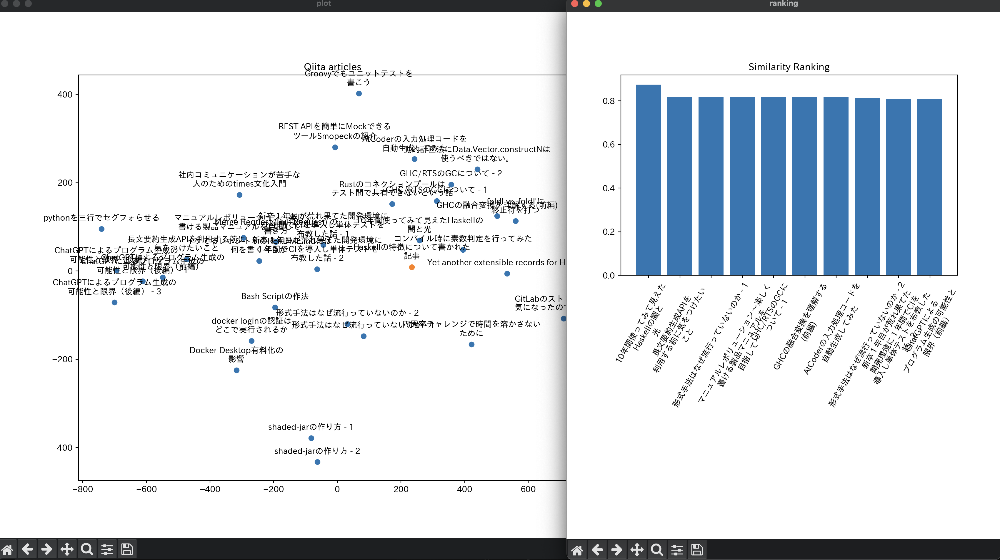

# テキスト埋め込みデモ
このデモではOpenAIのテキスト埋め込みモデル、`text-embedding-ada-002`を用いたテキスト分析を行うことができます。

## Requirements
- Python 3.11.1
- pipenv

## Getting Started

### Install
レポジトリをCloneして以下のコマンドを実行してください。

```bash
pipenv install
```

その後、OpenAIのAPI Keyを発行して`.env`に追記してください。

```bash
echo OPENAI_API_KEY={OpenAI API Key} >> .env
```

### Usage

```bash
$ pipenv run python main.py data/*.encoded
```

でツールが起動します。コマンドを入力することで、テキストを分析できます。

#### Search機能
この機能ではクエリ文に対して関連性の高い順に記事を並べた結果を返します。またクエリと記事の関連性を可視化した散布図を表示します。

実行例：

```txt
Command[search,recommend]search
Query:Haskellの特徴について書かれた記事
transform
prot data
    similarity                                       title
6     0.874702                     10年間使ってみて見えたHaskellの闇と光
7     0.818941                    長文要約生成APIを利用する前に気をつけたいこと
8     0.817560                        形式手法はなぜ流行っていないのか - 1
29    0.816732           マニュアルレボリューション〜楽しく書ける製品マニュアルを目指して〜
3     0.816638                          GHC/RTSのGCについて - 1
12    0.815808                           GHCの融合変換を理解する(前編)
14    0.815805                    AtCoderの入力処理コードを自動生成してみた
```



#### Recommend機能
この機能では記事のインデックスを指定して、その記事と関連する順番に記事を並べた結果を返します。またSearch機能と同様の可視化結果を表示します。

```txt
Command[search,recommend]recommend
Article Index:18
transform
prot data
    similarity                                       title
18    1.000000  Yet another extensible records for Haskell
6     0.820220                     10年間使ってみて見えたHaskellの闇と光
0     0.815348                     foldl vs. foldl'に終止符を打つ
12    0.808792                           GHCの融合変換を理解する(前編)
3     0.793719                          GHC/RTSのGCについて - 1
32    0.792199                           コンパイル時に素数判定を行ってみた
13    0.790353      動的計画法にData.Vector.constructNは使うべきではない。
4     0.789505                          GHC/RTSのGCについて - 2
14    0.786541                    AtCoderの入力処理コードを自動生成してみた
8     0.768513                        形式手法はなぜ流行っていないのか - 1
```

## データセットの生成方法
データセットは[@autotaker1984](https://qiita.com/autotaker1984)のQiita投稿記事から生成されています。自身の記事で分析を行う場合以下のようにしてください。

### 認証情報の設定
QiitaのAPI Tokenを発行して`.env`ファイルに追記します。

```bash
echo QIITA_API_TOKEN={API Token} >> .env
```

### 記事の取得
以下のコマンドでQiitaの記事を`data`以下にダウンロードできます。

```bash
pipenv run python gen_dataset.py
```

### (Optional)長さ調節
`test-embedding-ada-002`は8192トークンまで対応しています。長い記事は分割する必要があります。

`check_token_count.py`で長さをチェックできます。

```bash
pipenv run python check_token_count.py data/*.md
```

8192トークンを超えたものは適宜手動で分割するなどして調節してください。

### 埋め込みの取得
以下のコマンドでOpenAI APIを用いてデータセットに対するテキスト埋め込みを計算することができます。

```bash
pipenv run python gen_embeddings.py data/*.md
```

OpenAIのAPIを叩くのでRate Limitに引っかからないように注意してください。

以上でデータセットの生成は完了です。
